# 数据库管理系统设计文档

## 1. 设计目标描述

### 1.1 核心问题
本系统设计关注以下核心问题：

1. **SQL语句解析与执行效率**
   - 实现高效的词法分析和语法分析
   - 优化SQL执行计划
   - 支持复杂查询操作

2. **数据一致性与并发控制**
   - 实现表级锁机制
   - 支持事务ACID特性
   - 处理并发访问冲突

3. **数据存储与管理**
   - 采用CSV文件存储方案
   - 实现高效的文件操作
   - 保证数据完整性

4. **用户界面交互**
   - 提供Web操作界面
   - 支持多语句执行
   - 实现结果可视化

### 1.2 参考产品分析
以SQLite为参考，分析其特点：

1. **轻量级设计**
   - 单文件数据库
   - 零配置部署
   - 内存占用小

2. **自给自足**
   - 无外部依赖
   - 跨平台支持
   - 嵌入式应用

3. **功能完整**
   - 支持标准SQL
   - ACID事务
   - 并发控制

## 2. 系统设计描述

### 2.1 静态图类

#### 2.1.1 类图设计

1. **SQL解析器类图**
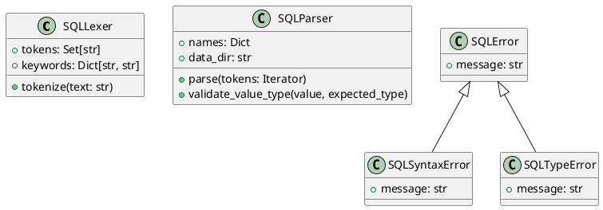

2. **数据管理类图**
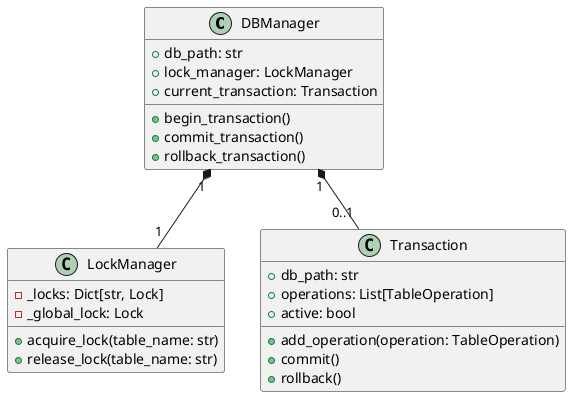

3. **SQL执行器类图**
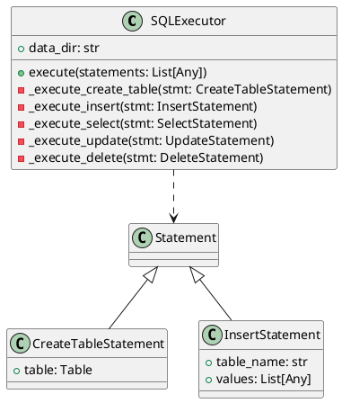

#### 2.1.2 对象图设计

1. **查询执行对象图**
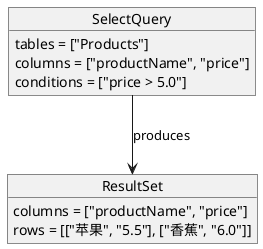

2. **事务处理对象图**
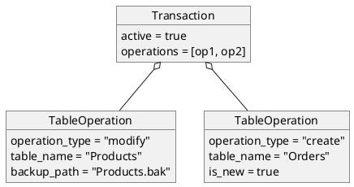

### 2.2 交互图类

#### 2.2.1 时序图设计

1. **SQL执行时序图**
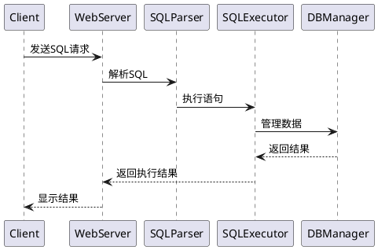

2. **事务处理时序图**
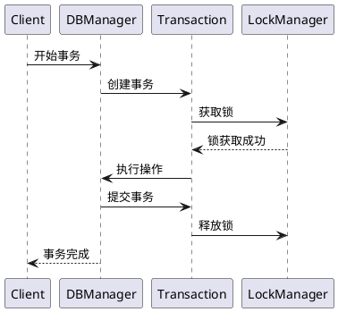

#### 2.2.2 协作图设计

1. **查询处理协作图**
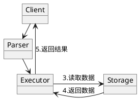

2. **数据更新协作图**
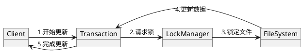

### 2.3 行为图类

#### 2.3.1 活动图设计

1. **SQL处理活动图**
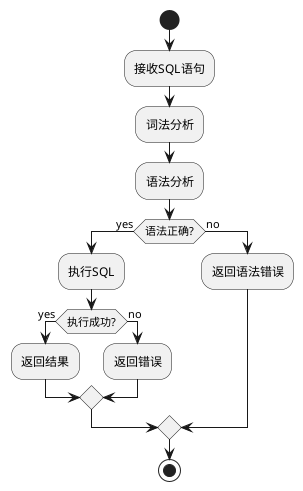

2. **事务处理活动图**
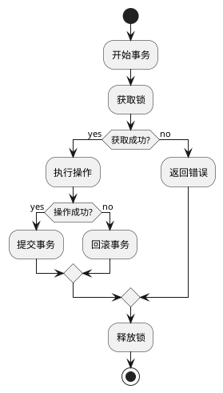

#### 2.3.2 状态图设计

1. **事务状态图**
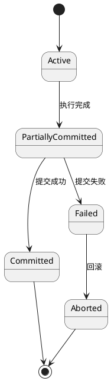

2. **表锁状态图**
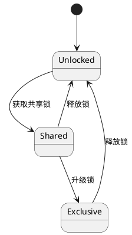

### 2.4 实现图类

#### 2.4.1 部署图设计
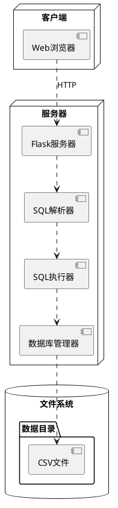

#### 2.4.2 组件图设计
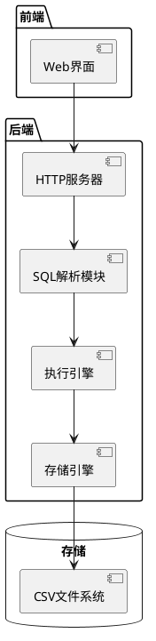

### 2.5 补充设计图

#### 2.5.1 数据结构图
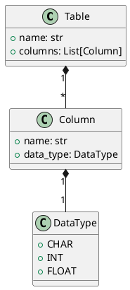

#### 2.5.2 数据流图
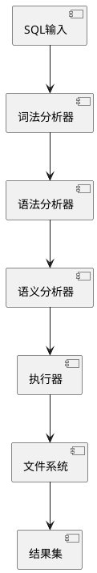

## 3. 关键设计说明

### 3.1 SQL解析器设计
1. 使用SLY库实现词法和语法分析
2. 支持标准SQL语法子集
3. 实现类型系统和语义检查

### 3.2 执行器设计
1. 实现基本SQL操作
2. 支持条件过滤和表连接
3. 实现结果集处理

### 3.3 存储引擎设计
1. 基于CSV文件存储
2. 实现表级锁机制
3. 支持事务日志

### 3.4 并发控制设计
1. 实现两阶段锁协议
2. 支持事务隔离级别
3. 死锁检测和预防

### 3.5 Web接口设计
1. RESTful API设计
2. 结果集格式化
3. 错误处理机制

## 4. 总结

本设计文档详细描述了一个基于Python的简单数据库管理系统的设计和实现。通过使用UML工具，我们从不同角度展示了系统的结构和行为：

1. 静态图类展示了系统的类结构和对象关系
2. 交互图类描述了系统组件间的消息传递
3. 行为图类展示了系统的动态特性
4. 实现图类说明了系统的物理部署
5. 补充设计图提供了额外的系统视图

系统的主要特点包括：
- 模块化设计
- 清晰的层次结构
- 完整的事务支持
- 可扩展的��构

通过这些设计，系统实现了一个功能完整、结构清晰的小型数据库管理系统。 